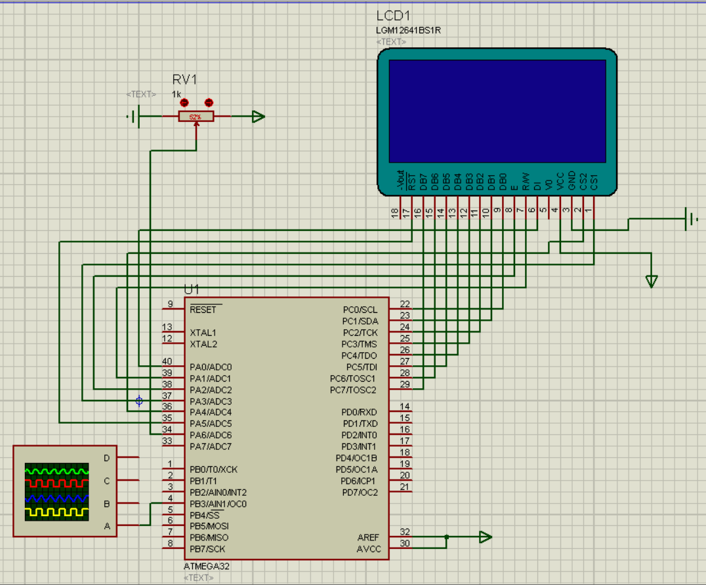
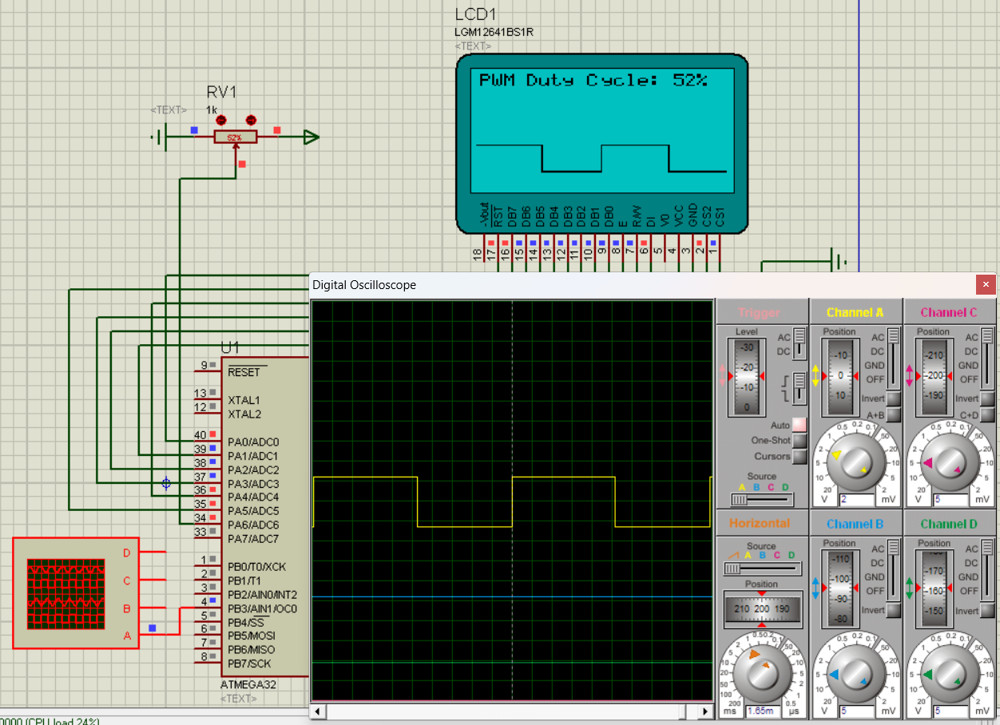

```markdown
# AVR ADC to PWM Signal Visualizer on GLCD
This is a project for AVR microcontrollers that reads an analog input to control the duty cycle of a Pulse Width Modulation (PWM) signal. The project provides real-time visual feedback on a Graphical LCD (GLCD), displaying the duty cycle percentage and a simple graphical representation of the waveform.
This project was fully designed and validated within the **Proteus Design Suite** simulation environment.

## 📝 Description
The core functionality of this project is to create a closed-loop control system where an analog sensor's reading (a potentiometer) directly influences a PWM output. This is a foundational concept in embedded systems, often used for applications like DC motor speed control, LED dimming, or controlling servo motors.
The system continuously samples an ADC channel, scales the 10-bit result to an 8-bit value, and updates the PWM duty cycle via the Timer0 Output Compare Register. Simultaneously, it calculates the percentage of the duty cycle and renders it on a GLCD, along with a live waveform drawing.

## ✨ Features
-   **Analog Input:** Reads a 10-bit analog value from a specified ADC channel.
-   **PWM Generation:** Generates a Fast PWM signal using Timer0.
-   **Dynamic Duty Cycle Control:** The PWM duty cycle is directly proportional to the analog input value.
-   **Graphical Display:** Interfaces with a 128x64 GLCD (KS0108 controller) to display information.
-   **Real-time Visualization:** Shows the PWM duty cycle as a percentage and visualizes the signal waveform.
-   **Simulation Validated:** Tested and verified using Proteus, with an oscilloscope for signal accuracy.

## 💻 Proteus Simulation
This project was developed and verified in a simulation environment, providing a reliable way to test the firmware without requiring physical hardware. An oscilloscope was used to monitor the PWM output, allowing for direct comparison between the actual electrical signal and the waveform being drawn on the GLCD.


### Simulation in Action


## 🛠️ Simulation Components
-   **Microcontroller:** `ATMEGA32`
-   **Display:** `LGM12641BS1R` (128x64 Graphical LCD)
-   **Analog Input:** `RV1` Potentiometer (1kΩ)
-   **Test Equipment:** 4-Channel Oscilloscope

## 🔌 Connections
The connections in the Proteus schematic are as follows:
| ATmega32 Pin | Function       | Connected To                          |
| :----------- | :------------- | :------------------------------------ |
| **PA0** (40) | GLCD RS (DI)   | GLCD Pin 4 (DI)                       |
| **PA1** (39) | GLCD R/W       | GLCD Pin 5 (R/W)                      |
| **PA2** (38) | GLCD E         | GLCD Pin 6 (E)                        |
| **PA3** (37) | GLCD CS1       | GLCD Pin 15 (CS1)                     |
| **PA4** (36) | GLCD CS2       | GLCD Pin 16 (CS2)                     |
| **PA5** (35) | GLCD Reset     | GLCD Pin 17 (RST)                     |
| **PA6** (34) | ADC Input      | Potentiometer (RV1) Wiper             |
| **PB3** (4)  | PWM Output     | Oscilloscope Channel A                |
| **PC0-PC7**  | GLCD Data Bus  | GLCD Pins 7-14 (DB0-DB7)              |
| **AVCC, AREF**| ADC Reference  | Tied to VCC (+5V)                     |

## 📂 File Structure
This project is organized into a main application file and several hardware abstraction drivers to promote modularity and reuse.
-   `main.c`: Contains the main application logic, initializes peripherals, and implements the primary control loop.
-   `DIO.h` / `DIO.c`: A driver for Digital I/O operations.
-   `ADC.h` / `ADC.c`: A driver for the Analog-to-Digital Converter.
-   `Timer.h` / `Timer.c`: A driver for the Timer/Counter peripherals, configured for Fast PWM.
-   `GLCD.h` / `GLCD.c`: A driver for the KS0108-based Graphical LCD.
-   `GLCD_font.h`: Contains the font data (a 5x8 pixel bitmap for each character).

## 👤 Author
*   **Mostafa Eshra**


```
